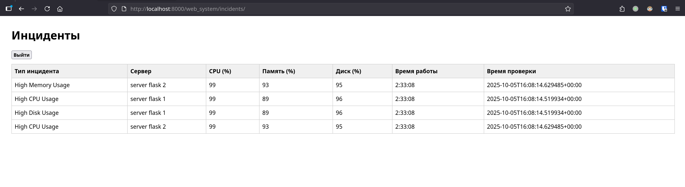

Система мониторинга ресурсов
---------------

Данный проект реализует систему мониторинга ресурсов удалённых машин с использованием Python 3.12, Django 5 и MySQL 8. Система предназначена для сбора метрик, мониторинга инцидентов и отображения их через веб-интерфейс с поддержкой аутентификации пользователей.


Архитектура и компоненты:
- **Django-приложение**: Основная логика реализована в виде Django-проектов и приложений (`data_collection`, `incident_monitoring`, `web_system`).
- **Celery**: Для фонового сбора данных с удалённых HTTP-эндпоинтов каждые 15 минут используется Celery.
- **MySQL**: Все метрики и инциденты сохраняются в базу данных MySQL 8.
- **Docker**: Поддерживается запуск через docker-compose для удобства развертывания.
- **Настройка**: Частота опроса системы и другие параметры настраиваются в ".env".

Реализация задач из ТЗ:
1. **Сбор данных с удалённых машин**
    - Периодический опрос HTTP-эндпоинтов (адреса настраиваются через админ-панель).
    - Получение и сохранение метрик: CPU, память, диск, время работы.
    - Фоновое выполнение реализовано через Celery.
    - Код поддерживает масштабирование и расширение числа опрашиваемых машин.

2. **Мониторинг и фиксация инцидентов**
    - Система анализирует собранные метрики и фиксирует инциденты при превышении пороговых значений:
        - CPU > 85% на любом замере
        - Память > 90% в течение 30 минут
        - Диск > 95% в течение 2 часов
    - Инциденты не дублируются, если уже есть активный инцидент того же типа по машине.
    - Пороговые значения можно поменять на любые другие

3. **Веб-интерфейс отображения инцидентов**
    - Реализован на Django с использованием ванильного JavaScript (без фреймворков).
    - Интерфейс автоматически обновляется без перезагрузки страницы.
    - Для доступа к интерфейсу требуется аутентификация пользователя.
    - Аутентификация реализована через собственный middleware (не стандартный Django).

Проект легко расширяется для добавления новых метрик, типов инцидентов и интеграции с другими сервисами.

Запуск:

1. Создать файл ".env". Заполнить его по примеру: "example.env".

2. Запустить Docker контейнеры командой
    ```bash
    docker-compose up -d
    ```
    Проверьте, что все контейнеры запустились, так как часто MariaDB не успевает запуститься.
    Так что лучше ещё раз пропишите: **docker-compose up**

3. Создать суперпользователя Django.
    ```bash
    docker exec -it monitoring_system-django-1 bash
    ```
    Внутри консоли контейнера прописать:
    ```bash
    python manage.py createsuperuser
    ```
    И создать своего суперпользователя.

4. Зайти в админ панель и добавить url к серверам, которые нужно мониторить. Например: http://60.60.200.100:5000/status

5. Автоматически начнутся запросы к этому эндпоинту. Он должен возвращать json в формате: 
```json
{ "cpu": 60, "mem": "30%", "disk": "43%", "uptime": "1d 2h 37m 6s" }
```

6. По настроенным в ".env" пороговым значениям будут мониториться инциденты. Они будут отображаться на странице: http://localhost:8000/web_system/incidents/


*Примечание: Также для тестирования был написан простой flask-сервер, который фейкует статусы серверов. Его реализация находится в папке `flask_test_servers`.
